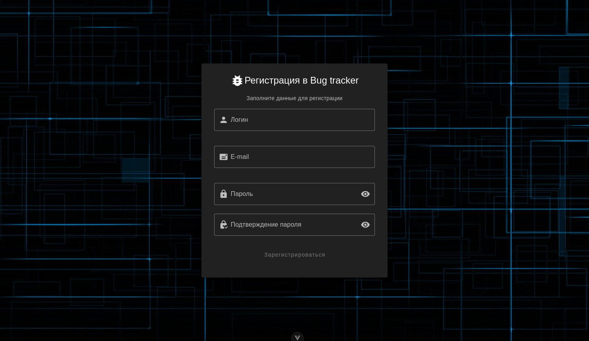
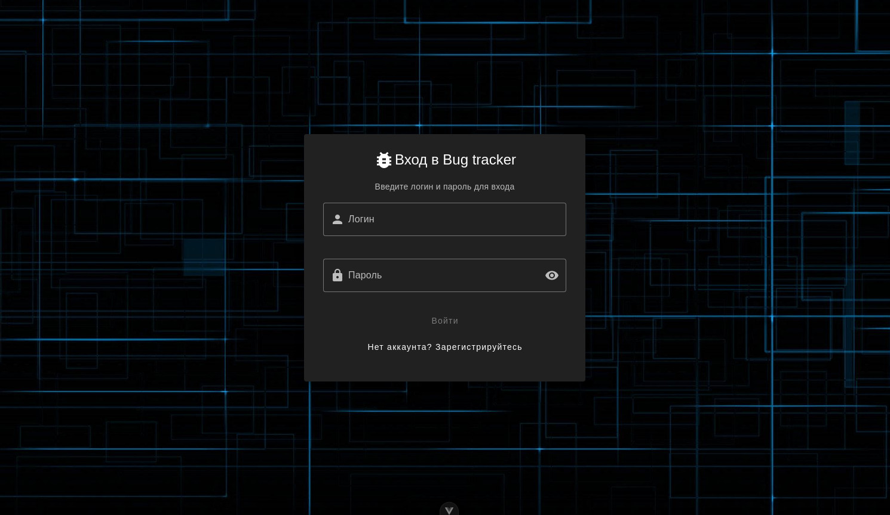
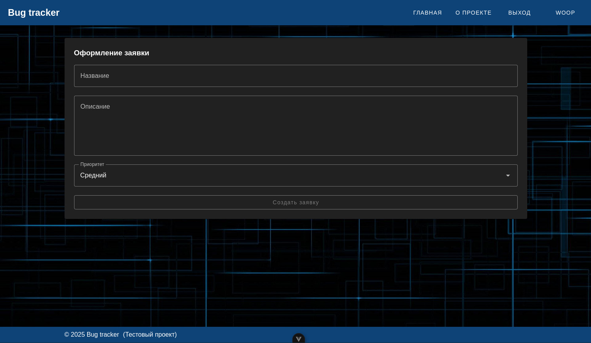
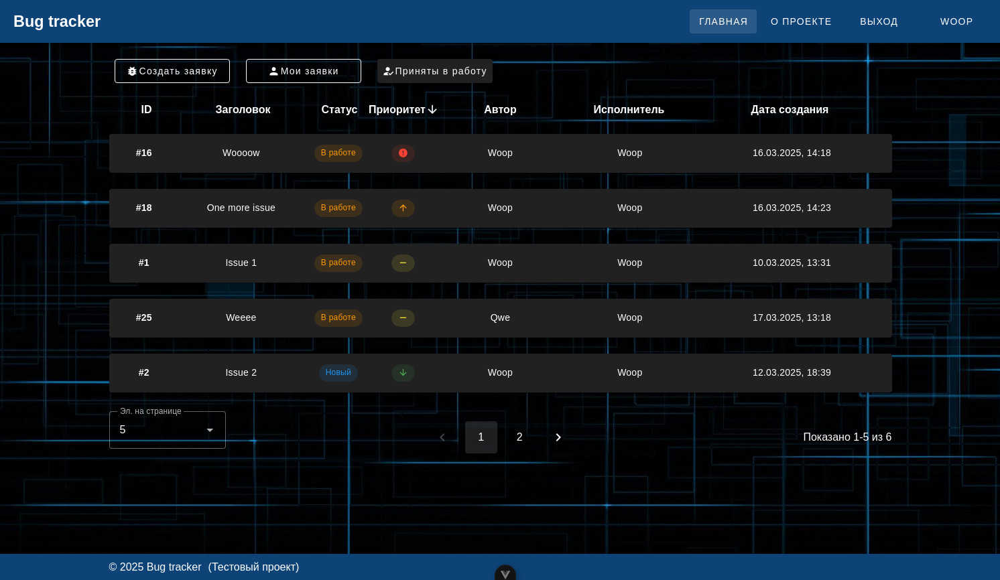
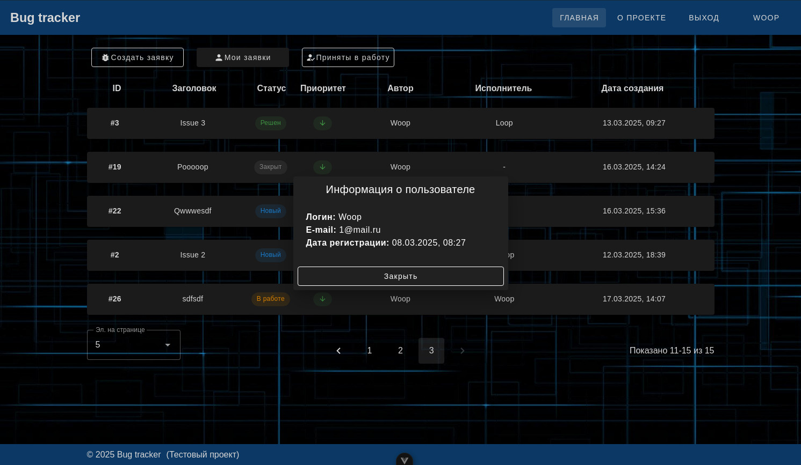
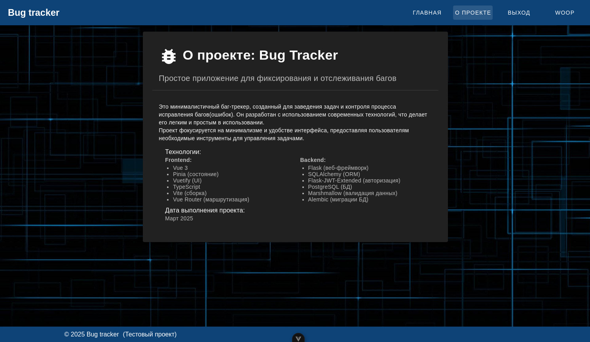
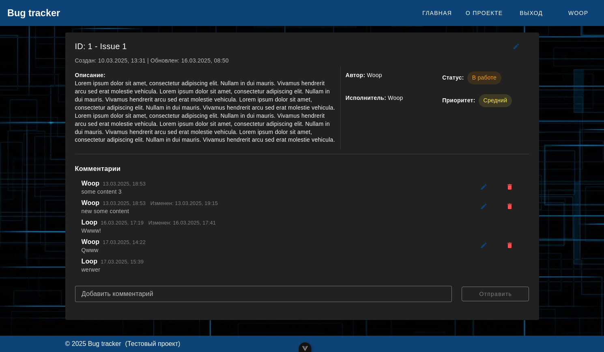
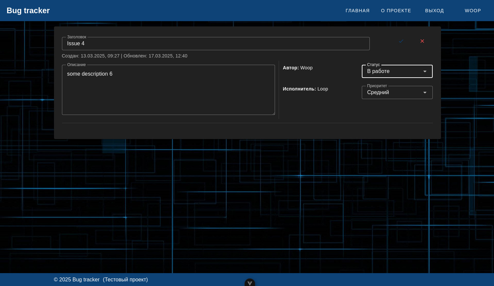
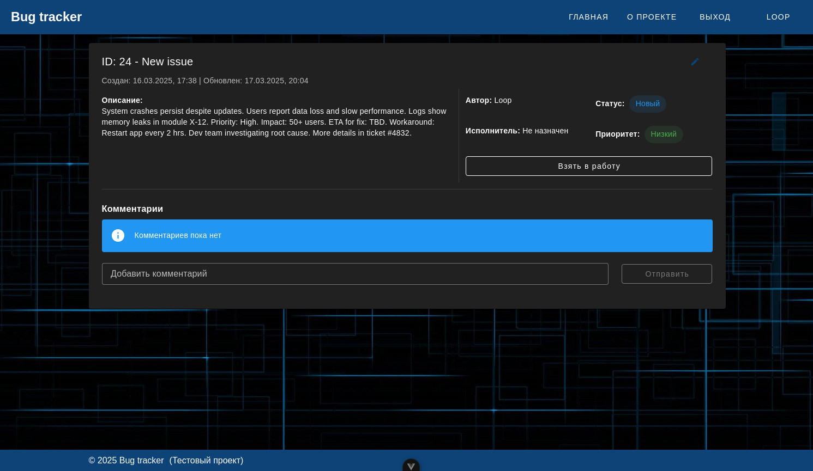

# Bug Tracker — Тестовое задание на full-stack разработчика

## Оглавление

1. [О проекте](#о-проекте)
2. [Технологический стек](#технологический-стек)
3. [Реализованный функционал](#реализованный-функционал)
4. [Дата выполнения](#дата-выполнения)
5. [Скриншоты](#скриншоты)
6. [Видео демонстрация](#видео-демонстрация)
7. [Как развернуть/запустить](#как-развернутьзапустить)
8. [Итоги](#итоги)

## О проекте

Минималистичный баг-трекер, разработанный как тестовое задание для позиции full-stack разработчика.
Основная цель — продемонстрировать навыки работы с современными технологиями фронтенда и бэкенда,
создав простое, но функциональное приложение для фиксирования и отслеживания процесса исправления
багов.

Задание включало следующие требования:

- **Бэкенд**: Python, Flask, PostgreSQL, SQLAlchemy
- **Фронтенд**: TypeScript, Vue 3, Vuetify
- **Функционал**: Создание, просмотр и управление задачами (багами)

Проект реализован с акцентом на минимализм, удобство интерфейса и реализацию архитектурных подходов,
что делает его расширяемым и поддерживаемым.

## Технологический стек

### Backend

- **Python** — Основной язык разработки
- **Flask** — Веб-фреймворк для создания REST API
- **PostgreSQL** — Реляционная база данных для хранения задач
- **SQLAlchemy** — ORM для взаимодействия с базой данных
- **Flask-JWT-Extended** — Реализация авторизации с использованием JWT-токенов
- **Marshmallow** — Сериализация и валидация данных
- **Alembic** — Инструмент для управления миграциями базы данных

### Frontend

- **Vue 3** — Прогрессивный фреймворк для построения веб интерфейса
- **TypeScript** — Статическая типизация для повышения надёжности кодовой базы
- **Vuetify** — Библиотека Material Design компонентов для быстрой разработки UI
- **Pinia** — Управление состояниями приложения
- **Vue Router** — Навигация между страницами
- **Vite** — Инструмент сборки и разработки

## Реализованный функционал

- Регистрация новых пользователей
- Авторизация пользователей
- Создание новых задач с указанием заголовка, описания и приоритета
- Редактирование существующих задач с изменением заголовка, описания, приоритета и статуса
- Просмотр списка всех задач с сортировкой по приоритету, статусу и дате создания
- Фильтрация списка задач по автору и исполнителю
- Создание, редактирование и удаление комментариев к задачам
- Минималистичный и интуитивно понятный интерфейс

## Дата выполнения

Март 2025

## Скриншоты

<details>
<summary>Нажмите, чтобы открыть спойлер</summary>

Страница регистрации



Страница авторизации



Общий вид списка задач


Страница создания задачи



Фильтр списка задач по исполнителю и сортировка по приоритету



Модальное окно с информацией о пользователе



Страница "О проекте"



Страница задачи в работе с комментариями



Редактирование задачи автором



Страница новой задачи без исполнителя и без комментариев



</details>

## Видео демонстрация

[Демонстрация](https://github.com/user-attachments/assets/9e239bad-f13a-420d-a146-b7a4dab2f43a)

## Как развернуть/запустить

Для запуска проекта необходимо выполнить следующие шаги:

1. Клонируйте репозиторий с помощью команды:

   ```bash
   git clone https://github.com/ath31st/bug_tracker.git

   ```

2. Перейдите в директорию проекта:

   ```bash
   cd bug_tracker

   ```

3. Подготовьте три файла `.env` с настройками окружения:

   Все значения указаны для наглядности и в качестве примера, вы можете использовать свои
   значения.

   - В корневой директории создайте файл `.env` со следующим содержимым:

     ```
     DB_USER=postgres
     DB_PASSWORD=postgres
     DB_NAME=bt_db
     DB_OUTER_PORT=5434

     CLIENT_INNER_PORT=80
     SERVER_OUTER_PORT=5010

     ```

   - В директории `./server/` создайте файл `.env` со следующим содержимым:

     ```
     DATABASE_URL=postgresql+psycopg2://postgres:postgres@db:5432/bt_db
     SECRET_KEY=oooof_very_secret_key
     JWT_SECRET_KEY=oooof_very_jwt_secret_key
     JWT_ACCESS_TOKEN_EXPIRES=3600
     JWT_REFRESH_TOKEN_EXPIRES=604800

     ```

   - В директории `./client/` создайте файл `.env` со следующим содержимым:
     ```
     VITE_PUBLIC_API_URL=http://айпи_адрес_вашего_пк_или_сервера:5010/api/v1
     ```

4. Убедитесь, что у вас установлен Docker и Docker Compose.

   ```bash
   docker --version
   ```

   ```bash
   docker-compose --version

   ```

5. Выполните команду для сборки и запуска контейнеров в фоновом режиме:

   ```bash
   docker-compose up -d

   ```

6. Дождитесь завершения развертывания контейнеров.
   Это может занять несколько минут, в зависимости от вашей системы.

7. Откройте браузер и перейдите по адресу:
   http://localhost:80

После выполнения этих шагов приложение будет доступно для использования.
Убедитесь, что указанные порты (`5434` для базы данных, `5010` для сервера и `80` для клиента) не
заняты другими процессами на вашем пк или сервере.

## Итоги

В рамках тестового задания был создан полноценный баг-трекер, который отвечает указанным
требованиям.
Проект демонстрирует:

- Умение работать с Flask и SQLAlchemy для создания REST API
- Навыки настройки PostgreSQL и миграций через Alembic
- Опыт разработки интерфейсов с использованием Vue 3, TypeScript и Vuetify
- Понимание интеграции фронтенда и бэкенда через API
- Применение минималистичного подхода к дизайну и архитектуре

Код структурирован, следует принципам SOLID, DRY, KISS и готов к дальнейшему расширению
функционала (например, добавлению ролей пользователей, рефреш-токенов).
