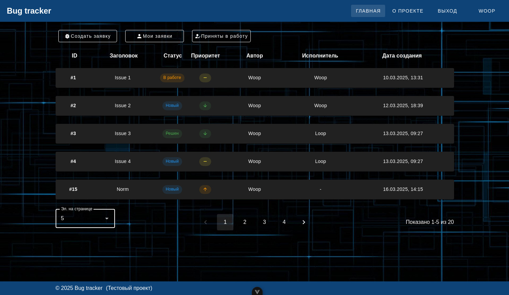

# Bug Tracker — Тестовое задание на full-stack разработчика

## О проекте

Минималистичный баг-трекер, разработанный как тестовое задание для позиции full-stack разработчика. Основная цель — продемонстрировать навыки работы с современными технологиями фронтенда и бэкенда, создав простое, но функциональное приложение для фиксирования и отслеживания процесса исправления багов.

Задание включало следующие требования:

- **Бэкенд**: Python, Flask, PostgreSQL, SQLAlchemy
- **Фронтенд**: TypeScript, Vue 3, Vuetify
- **Функционал**: Создание, просмотр и управление задачами (багами)

Проект реализован с акцентом на минимализм, удобство интерфейса и реализацию архитектурных подходов, что делает его расширяемым и поддерживаемым.

## Технологический стек

### Backend

- **Python** — Основной язык разработки
- **Flask** — Веб-фреймворк для создания REST API
- **PostgreSQL** — Реляционная база данных для хранения задач
- **SQLAlchemy** — ORM для взаимодействия с базой данных
- **Flask-JWT-Extended** — Реализация авторизации с использованием JWT-токенов
- **Marshmallow** — Сериализация и валидация данных
- **Alembic** — Инструмент для управления миграциями базы данных

### Frontend

- **Vue 3** — Прогрессивный фреймворк для построения веб интерфейса
- **TypeScript** — Статическая типизация для повышения надёжности кодовой базы
- **Vuetify** — Библиотека Material Design компонентов для быстрой разработки UI
- **Pinia** — Управление состояниями приложения
- **Vue Router** — Навигация между страницами
- **Vite** — Инструмент сборки и разработки

## Реализованный функционал

- Регистрация новых пользователей
- Авторизация пользователей
- Создание новых задач с указанием заголовка, описания и приоритета
- Редактирование существующих задач с изменением заголовка, описания, приоритета и статуса
- Просмотр списка всех задач с сортировкой по приоритету, статусу и дате создания
- Фильтрация списка задач по автору и исполнителю
- Создание, редактирование и удаление комментариев к задачам
- Минималистичный и интуитивно понятный интерфейс

## Дата выполнения

Март 2025

## Скриншоты

Нажмите, чтобы открыть спойлер

Страница регистрации

Страница авторизации

Общий вид списка задач

Страница создания задачи

Фильтр списка задач по исполнителю и сортировка по приоритету

Модальное окно с информацией о пользователе

Страница "О проекте"

Страница задачи в работе с комментариями

Редактирование задачи автором

Страница новой задачи без исполнителя и без комментариев

## Видео демонстрация

Нажмите, чтобы открыть спойлер

## Как развернуть/запустить

_(Будет добавлено позже.)_

## Итоги

В рамках тестового задания был создан полноценный баг-трекер, который отвечает указанным требованиям. Проект демонстрирует:

- Умение работать с Flask и SQLAlchemy для создания REST API
- Навыки настройки PostgreSQL и миграций через Alembic
- Опыт разработки интерфейсов с использованием Vue 3, TypeScript и Vuetify
- Понимание интеграции фронтенда и бэкенда через API
- Применение минималистичного подхода к дизайну и архитектуре

Код структурирован, следует принципам SOLID, DRY, KISS и готов к дальнейшему расширению функционала (например, добавлению ролей пользователей, рефреш-токенов).
